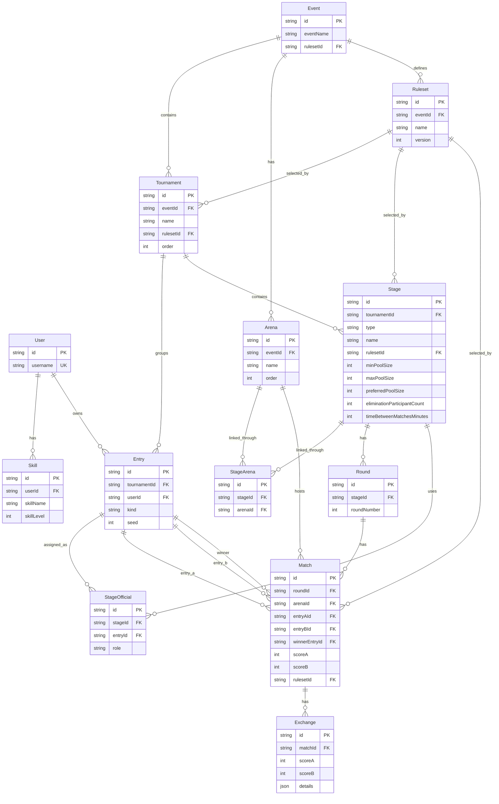

# Database

## Notes

- One event can contain multiple tournaments.
- Entries are unique per tournament, so the same user can appear in multiple tournaments inside one event.
- Stages belong to a tournament, while arenas still belong to an event.
- Match is the canonical fight/result record; "bout" is a compatibility label in the competition UI.
- Round is a tournament-planning concept, not a per-hit fight round.
- Match event details stay in JSON for now so exchanges, warnings, timeouts and disqualifications can be refined later.
- Rulesets are event-scoped and versioned; stages own pool sizing and timing, and matches reference a specific ruleset version snapshot.
