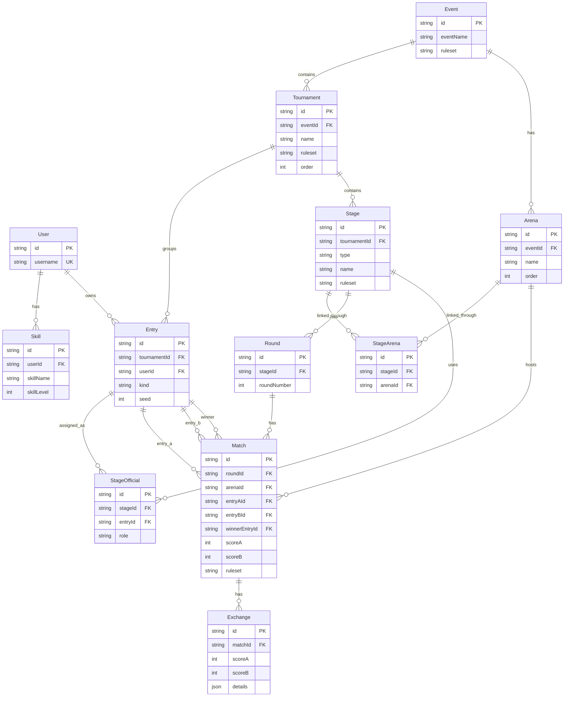

# Database

## Notes

- One event can contain multiple tournaments.
- Entries are unique per tournament, so the same user can appear in multiple tournaments inside one event.
- Stages belong to a tournament, while arenas still belong to an event.
